# 2026年第十六届MathorCup数学应用挑战赛 C题

# 基于可解释机器学习的中医体质-高血脂风险关联与三级预警模型研究

---

## 摘要

本文针对1000例中老年人样本，围绕三个核心问题展开系统研究：**问题1A** 筛选痰湿质严重度关键指标，**问题1B** 筛选高血脂风险预警关键指标，**问题2/2扩展** 定量评估九种中医体质对高血脂风险的差异贡献并构建三级预警模型。

方法层面，采用"三阶段特征筛选框架（Spearman+FDR → L1稀疏回归 → SHAP稳定性选择）"处理问题1，多变量Logistic回归 + XGBoost + 分层SHAP处理问题2；在问题2扩展中，构建以XGBoost非血脂早筛模型（Stage-A）为核心、Excess-AUC客观权重推导的**复合风险评分**，实现三级（低/中/高）动态预警。

**主要结论：**
- **TC、TG**是高血脂最强预警指标（XGBoost OOF AUC = 0.998），稳定性频率100%；
- **血尿酸**是最重要独立危险因素（多变量OR = 1.51，P < 0.001）；
- 痰湿质积分无法被客观生化指标预测（R² ≈ 0），体现中医辨证独立性；
- 三级预警模型早筛AUC = 0.881（95%CI [0.853, 0.914]），权重由数据驱动（Excess-AUC法），切点稳健（灵敏度分析：权重±30%最大级别变动 ≤ 3.4%）。

---

## 目录

1. [问题描述与拆分](#1-问题描述与拆分)
2. [数据概况与预处理](#2-数据概况与预处理)
3. [建模方案总体设计](#3-建模方案总体设计)
4. [问题1A：痰湿质严重度关键指标筛选](#4-问题1a痰湿质严重度关键指标筛选)
5. [问题1B：高血脂风险预警关键指标筛选](#5-问题1b高血脂风险预警关键指标筛选)
6. [问题2：九种体质对高血脂风险的差异贡献](#6-问题2九种体质对高血脂风险的差异贡献)
7. [问题2扩展：三级高血脂风险预警模型](#7-问题2扩展三级高血脂风险预警模型)
8. [灵敏度分析](#8-灵敏度分析)
9. [综合结论与局限性](#9-综合结论与局限性)
10. [附录：代码框架与运行说明](#10-附录代码框架与运行说明)

---

## 1. 问题描述与拆分

### 1.1 研究背景

中医体质学说将人体体质分为九种类型（平和质、气虚质、阳虚质、阴虚质、**痰湿质**、湿热质、血瘀质、气郁质、特禀质），不同体质对慢性病的易感性存在差异。**高血脂症（Hyperlipidemia, HLD）**是心脑血管疾病的首要危险因素，而痰湿体质在中医理论中被认为与脂代谢紊乱密切相关。

本研究基于1000例中老年人多维度数据，解决以下核心问题：

| 子问题 | 因变量 | 任务类型 | 核心输出 |
|:-------|:-------|:---------|:---------|
| 1A 痰湿严重度 | 痰湿质积分（0–100，连续） | 回归 | $R^2$、RMSE、关键指标集 |
| 1B 高血脂风险预警 | 高血脂症（0/1，二分类） | 分类 | AUC、F1、关键指标集 |
| 2 体质贡献差异 | 高血脂症（0/1） | 推断+分类 | OR、95%CI、SHAP排序 |
| 2扩展 三级预警 | 低/中/高三级风险 | 复合评分 | 预警模型、阈值规则、核心组合 |

### 1.2 特征池

| 类别 | 变量 | 说明 |
|:-----|:-----|:-----|
| 血脂指标 | TC、TG、LDL-C、HDL-C | 总胆固醇、甘油三酯、低/高密度脂蛋白 |
| 代谢相关 | 空腹血糖、血尿酸、BMI | 葡萄糖代谢、嘌呤代谢、体重指数 |
| ADL能力 | ADL各分项 + ADL总分 | 日常生活活动能力（5项） |
| IADL能力 | IADL各分项 + IADL总分 | 工具性日常活动能力（5项） |
| 活动量表总分 | ADL总分 + IADL总分 | 综合活动能力 |
| 中医体质得分 | 9种体质积分 | 各体质辨识量表分（问题2使用） |
| 人口学协变量 | 年龄组、性别、吸烟史、饮酒史 | 混杂控制（问题2） |

---

## 2. 数据概况与预处理

### 2.1 样本基线特征

数据集共 **1000 例**，37个变量。

> **表1. 样本基线特征（按高血脂状态分组）**

| 变量 | 总体（n=1000） | 非高血脂（n=207） | 高血脂（n=793） | P值 |
|:-----|:--------------|:-----------------|:----------------|:----|
| TC（mmol/L） | 5.91±1.82 | 4.34±1.06 | 6.31±1.76 | **<0.001** |
| TG（mmol/L） | 1.88±1.01 | 0.96±0.41 | 2.13±0.98 | **<0.001** |
| LDL-C（mmol/L） | 2.61±0.61 | 2.38±0.48 | 2.67±0.62 | **<0.001** |
| HDL-C（mmol/L） | 1.30±0.26 | 1.39±0.21 | 1.28±0.27 | **<0.001** |
| 空腹血糖（mmol/L） | 4.98±1.01 | 5.07±0.97 | 4.96±1.01 | 0.206 |
| 血尿酸（μmol/L） | 337.83±141.35 | 293.17±72.42 | 349.49±152.25 | **<0.001** |
| BMI（kg/m²） | 21.93±2.94 | 21.78±3.01 | 21.97±2.92 | 0.403 |
| ADL总分 | 24.89±6.92 | 24.52±6.98 | 24.98±6.90 | 0.384 |
| IADL总分 | 24.82±7.17 | 24.79±7.38 | 24.83±7.11 | 0.731 |
| 活动量表总分 | 49.71±10.11 | 49.31±10.28 | 49.81±10.07 | 0.520 |
| 痰湿质积分 | 32.98±20.13 | 33.37±20.69 | 32.87±20.00 | 0.817 |

> 注：连续变量以均值±标准差表示，组间比较采用Mann-Whitney U检验。

**关键发现**：TC、TG、LDL-C、HDL-C、血尿酸在两组间差异极显著（P<0.001）；**痰湿质积分在两组间无统计学差异**（P = 0.817），提示痰湿积分与高血脂的关系需通过多变量建模深入探究。

### 2.2 预处理步骤

1. **列名标准化**：中文列名映射为英文标识符（见附录代码框架）
2. **血脂异常计数**：根据临床参考区间（TC ≤ 6.2 mmol/L，TG ≤ 1.7 mmol/L，LDL-C ≤ 3.1 mmol/L，HDL-C ≥ 1.04 mmol/L）计算每例异常血脂指标数量 `LipidAbnormalCount ∈ {0, 1, 2, 3, 4}`
3. **标准化**：问题1/2的连续特征统一进行Z-score标准化（$\mu=0, \sigma=1$），StandardScaler在交叉验证折内fit，防止测试折信息泄露
4. **类别不平衡**：高血脂阳性率79.3%，分类模型通过 `scale_pos_weight = N_{neg}/N_{pos} = 207/793 ≈ 0.261` 处理不平衡

---

## 3. 建模方案总体设计

### 3.1 方案选择理由

| 考量维度 | 方案 | 选择理由 |
|:---------|:-----|:---------|
| 样本规模（N=1000） | Elastic Net + XGBoost | 中小样本上比深度学习更稳健，无过拟合风险 |
| 变量共线性 | L1正则化 | TC/LDL-C、ADL各分项高度共线，L1自动稀疏 |
| 双重需求（预测+解释） | SHAP + OR | 同时输出机器学习可解释证据和统计推断证据 |
| 稳定性 | Bootstrap×100 | 单次特征选择不稳定，Bootstrap频率提供可靠估计 |
| 类别不平衡 | scale_pos_weight | 避免模型偏向多数类（高血脂阳性） |

### 3.2 三阶段特征筛选框架（问题1）

$$
\text{全部候选特征}
\xrightarrow{\text{Stage 1: Spearman+FDR}}
\text{显著相关集}
\xrightarrow{\text{Stage 2: L1稀疏回归}}
\text{多变量有效特征集}
\xrightarrow{\text{Stage 3: SHAP稳定性选择(×100)}}
\text{最终关键指标集}
$$

#### Stage 1 — 单因素预筛（Spearman + FDR校正）

对每个候选特征 $x_j$（$j = 1, \ldots, p$）与目标变量 $y$ 计算**Spearman秩相关系数**：

$$
r_s(x_j, y) = 1 - \frac{6\sum_{i=1}^n d_i^2}{n(n^2-1)}, \quad d_i = \text{rank}(x_{ij}) - \text{rank}(y_i)
$$

由于同时对 $p$ 个特征进行假设检验，使用 **Benjamini-Hochberg FDR校正**控制假阳性率：

$$
H_0^{(j)} \text{ 被拒绝} \iff p_{(j)} \leq \frac{j}{p} \cdot q^*, \quad q^* = 0.05
$$

其中 $p_{(1)} \leq p_{(2)} \leq \cdots \leq p_{(p)}$ 为 $p$ 值排序，$j$ 为最大满足不等式的秩次。

#### Stage 2 — L1稀疏多变量筛选

**回归任务（1A）— Elastic Net：**

$$
\hat{\boldsymbol{\beta}}^{\text{EN}} = \arg\min_{\boldsymbol{\beta}} \left\{ \frac{1}{2n}\|\mathbf{y} - \mathbf{X}\boldsymbol{\beta}\|_2^2 + \lambda\left[\alpha\|\boldsymbol{\beta}\|_1 + \frac{1-\alpha}{2}\|\boldsymbol{\beta}\|_2^2\right] \right\}
$$

- $\lambda$：正则化强度（5折×5重复交叉验证自动选择，$\lambda^* = 15.06$）
- $\alpha \in [0,1]$：L1/L2混合比（搜索空间 $\{0.1, 0.3, 0.5, 0.7, 0.9, 1.0\}$，$\alpha^* = 0.10$）
- 当 $\hat{\beta}_j = 0$ 时，特征 $j$ 被自动排除

**分类任务（1B）— L1 Logistic 回归（Lasso Logistic）：**

$$
\hat{\boldsymbol{\beta}}^{\text{L1}} = \arg\min_{\boldsymbol{\beta}} \left\{ -\frac{1}{n}\sum_{i=1}^n \left[y_i \log \sigma(\mathbf{x}_i^\top\boldsymbol{\beta}) + (1-y_i)\log(1-\sigma(\mathbf{x}_i^\top\boldsymbol{\beta}))\right] + \lambda\|\boldsymbol{\beta}\|_1 \right\}
$$

$$
\sigma(z) = \frac{1}{1+e^{-z}} \quad (\text{sigmoid函数})
$$

固定 $C = 1/\lambda = 0.1$（较强惩罚），L1惩罚将不重要特征系数压缩为零。

#### Stage 3 — SHAP稳定性选择（×100 Bootstrap）

XGBoost使用**TreeSHAP**算法精确计算每个样本特征的Shapley值：

$$
\phi_j(\mathbf{x}_i) = \sum_{S \subseteq \mathcal{F} \setminus \{j\}} \frac{|S|!\,(|\mathcal{F}|-|S|-1)!}{|\mathcal{F}|!}\left[v(S \cup \{j\}) - v(S)\right]
$$

其中：
- $\mathcal{F}$：全特征集，$|\mathcal{F}| = p$
- $S$：不包含特征 $j$ 的任意子集
- $v(S) = \mathbb{E}[f(\mathbf{x}) \mid \mathbf{x}_S]$：使用特征子集 $S$ 时的期望模型输出

特征 $j$ 的**全局重要性**：

$$
\bar{\phi}_j = \frac{1}{n}\sum_{i=1}^n |\phi_j(\mathbf{x}_i)|
$$

**SHAP稳定性频率**定义：对原始数据进行 $B = 100$ 次有放回抽样（Bootstrap），每次独立拟合XGBoost模型并计算SHAP，统计每次Top-10特征中特征 $j$ 出现的频率：

$$
f_j^{\text{stab}} = \frac{1}{B}\sum_{b=1}^B \mathbf{1}\left[j \in \text{Top-10}(\bar{\phi}^{(b)})\right], \quad f_j^{\text{stab}} \in [0, 1]
$$

**选择标准**：$f_j^{\text{stab}} > 0.50$ 视为稳定重要特征。

### 3.3 模型评估策略

| 任务 | 评估方法 | 评估指标 |
|:-----|:---------|:---------|
| 回归（1A） | 5折×3重复CV（15折次） | $R^2$、RMSE |
| 分类（1B） | 5折分层CV，OOF预测概率 | AUC、F1、灵敏度、特异度 |
| 问题2分类 | 5折分层CV | AUC |
| 早筛模型（2扩展） | 5折分层CV，Pipeline内标准化 | OOF AUC、Bootstrap 95%CI |

**Youden最优阈值**：对分类任务，最优分类阈值 $\tau^*$ 由Youden指数最大化确定：

$$
\tau^* = \arg\max_\tau J(\tau), \quad J(\tau) = \text{Sensitivity}(\tau) + \text{Specificity}(\tau) - 1
$$

---

## 4. 问题1A：痰湿质严重度关键指标筛选

### 4.1 单因素筛选结果

对20个候选特征与痰湿质积分的Spearman相关系数计算FDR校正后，**所有特征均未通过显著性阈值**（最小FDR校正P = 0.255，对应ADL_Eating，$r_s = -0.079$）。

**解读**：血液生化指标和活动量表得分与痰湿积分之间不存在显著线性单调关系，提示痰湿质的辨识具有独立的中医量表维度。

### 4.2 多变量模型性能

> **表2. 痰湿质严重度预测模型性能（5折×3重复交叉验证）**

| 模型 | $R^2$（均值±标准差） | RMSE（均值±标准差） |
|:-----|:-------------------|:-------------------|
| Elastic Net | $-0.008 \pm 0.009$ | $20.16 \pm 0.61$ |
| XGBoost | $-0.174 \pm 0.058$ | $21.74 \pm 0.66$ |

> 注：$R^2 < 0$ 意味着模型预测能力劣于零模型（预测值=均值），痰湿积分标准差为20.13。

**解读**：$R^2 \approx 0$ 与单因素结果一致，**本特征池对痰湿积分没有实质预测能力**。这一结果本身具有重要科学意义：说明痰湿体质严重程度不能被血脂、血糖、活动能力等客观指标简单量化，需要纳入中医特色指标（舌苔、脉象等）。

### 4.3 SHAP稳定性分析结果

尽管整体 $R^2 \approx 0$，SHAP稳定性选择揭示了相对最关联的特征排序：

> **表4A. 痰湿质关键指标稳定性排序（Top-9）**

| 排名 | 特征 | 平均\|SHAP\| | 稳定性频率 | Spearman $r_s$ | 方向 |
|:-----|:-----|:------------|:---------|:--------------|:-----|
| 1 | **BMI** | 2.303 | **100%** | −0.022 | 负 |
| 2 | **TC** | 1.647 | **100%** | −0.035 | 负 |
| 3 | ADL_Eating | 1.366 | 59% | −0.079 | 负 |
| 4 | **HDL-C** | 1.359 | **95%** | +0.014 | 正 |
| 5 | **ADL_Total** | 1.346 | 83% | −0.053 | 负 |
| 6 | **LDL-C** | 1.318 | **94%** | +0.010 | 正 |
| 7 | **TG** | 1.242 | **95%** | −0.016 | 负 |
| 8 | **空腹血糖** | 1.177 | **94%** | −0.020 | 负 |
| 9 | **血尿酸** | 1.131 | **94%** | −0.010 | 负 |

> 注：稳定性频率 ≥ 50% 以粗体标注。SHAP反映非线性交互重要性，但所有 $r_s$ 均不显著（FDR校正后P > 0.25）。

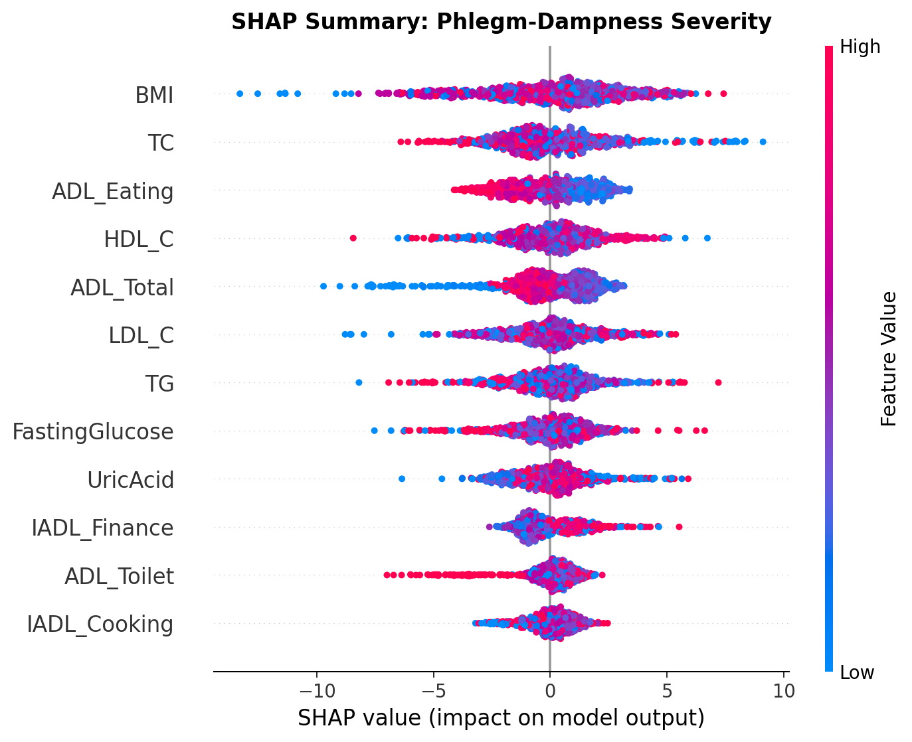

> **图2A. 痰湿质严重度模型SHAP蜂群图（XGBoost）**
> 横轴为SHAP值（正值=该特征使预测痰湿积分增大），颜色表示特征值高低（红色=高值，蓝色=低值）。各点SHAP值分布广、无明显方向性，与 $R^2 \approx 0$ 的结论一致。

### 4.4 小结

- 在本数据集中，血脂指标、代谢指标和活动量表对痰湿积分**不具备独立预测力**（$R^2 \approx 0$）
- **BMI和TC**是稳定性最高的参考指标（100%），可作为痰湿程度的伴随生化标记
- 未来痰湿严重度的客观量化需要纳入中医特色指标（舌苔厚度、脉象参数等）

---

## 5. 问题1B：高血脂风险预警关键指标筛选

### 5.1 单因素筛选结果

通过Spearman相关+FDR校正，5个特征与高血脂标签显著相关（$q < 0.05$）：

| 特征 | Spearman $r_s$ | FDR校正P值 | 方向 |
|:-----|:--------------|:----------|:-----|
| TG（甘油三酯） | **+0.489** | $7.4 \times 10^{-60}$ | ↑ |
| TC（总胆固醇） | +0.435 | $1.6 \times 10^{-46}$ | ↑ |
| 血尿酸 | +0.204 | $4.7 \times 10^{-10}$ | ↑ |
| LDL-C | +0.184 | $2.3 \times 10^{-8}$ | ↑ |
| HDL-C（高密度脂蛋白） | **−0.166** | $5.6 \times 10^{-7}$ | ↓ |

活动量表、BMI、血糖与高血脂无显著关联（FDR校正P > 0.6）。

### 5.2 L1正则化Logistic回归

固定 $C = 0.1$，L1 Logistic回归最终保留5个非零系数：

$$
\log\frac{p}{1-p} = \hat{\beta}_0 + \underbrace{2.74}_{\text{TG}} \cdot \text{TG}^* + \underbrace{2.04}_{\text{TC}} \cdot \text{TC}^* \underbrace{- 0.45}_{\text{HDL-C}} \cdot \text{HDL-C}^* + \underbrace{0.40}_{\text{UricAcid}} \cdot \text{UA}^* + \underbrace{0.39}_{\text{LDL-C}} \cdot \text{LDL-C}^*
$$

其中 $(\cdot)^*$ 表示Z-score标准化值。**TG系数最大（2.74）**，是最有效的单一区分指标。

5折分层OOF评估：**AUC = 0.977，F1 = 0.930**，灵敏度 = 90.8%，特异度 = 93.2%。

### 5.3 XGBoost模型性能

> **表3. 高血脂风险预测模型性能（5折分层OOF）**

| 模型 | AUC（OOF） | F1 | 灵敏度 | 特异度 |
|:-----|:----------|:---|:------|:------|
| Logistic L1 | 0.977 | 0.930 ± 0.015 | 90.8% | 93.2% |
| **XGBoost** | **0.998** | **0.998 ± 0.003** | **100.0%** | **98.6%** |

XGBoost以OOF AUC = **0.998** 区分高血脂状态，说明TC、TG等血脂指标与高血脂标签之间存在**极强的非线性可分关系**。

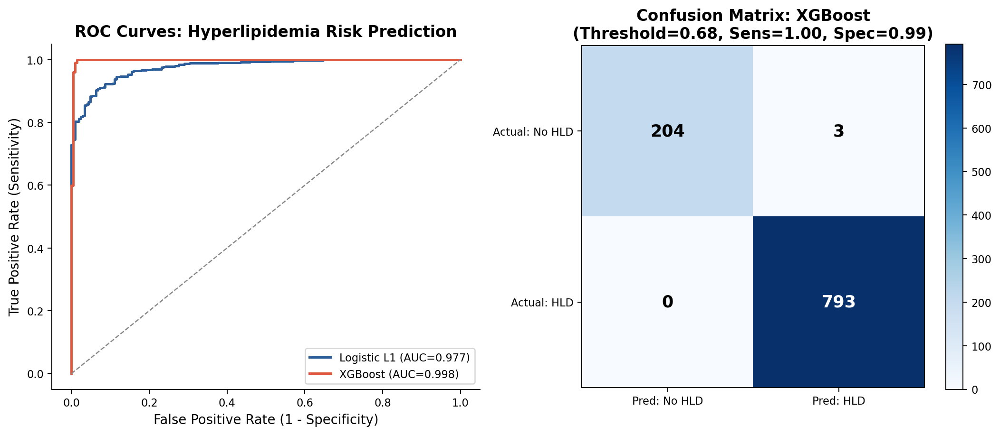

> **图4. 高血脂风险预测ROC曲线（左）与XGBoost混淆矩阵（右）**
> 左图：两模型OOF ROC曲线，XGBoost（AUC=0.998）远超逻辑回归基线；右图：XGBoost在Youden最优阈值下的混淆矩阵，误分类样本极少。

### 5.4 SHAP重要性分析

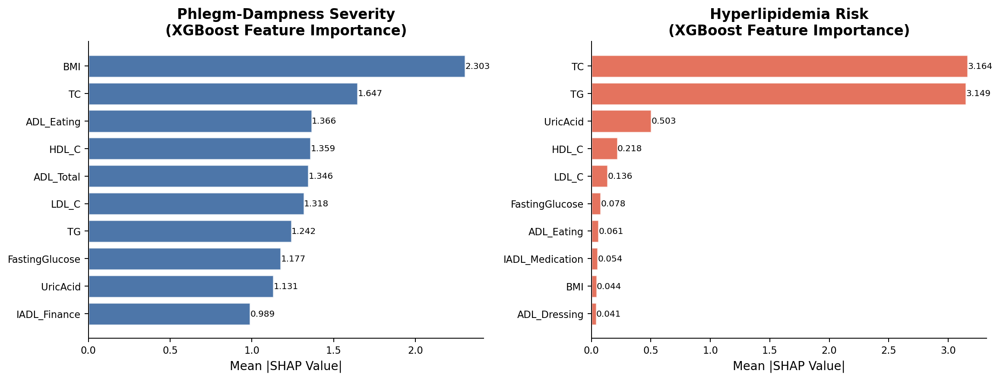

> **图1. 两任务XGBoost Top-10特征重要性（平均|SHAP|）**
> 左图（痰湿质）：各特征SHAP值均匀、微弱；右图（高血脂）：TC和TG的SHAP值远高于其他特征，形成压倒性主导。

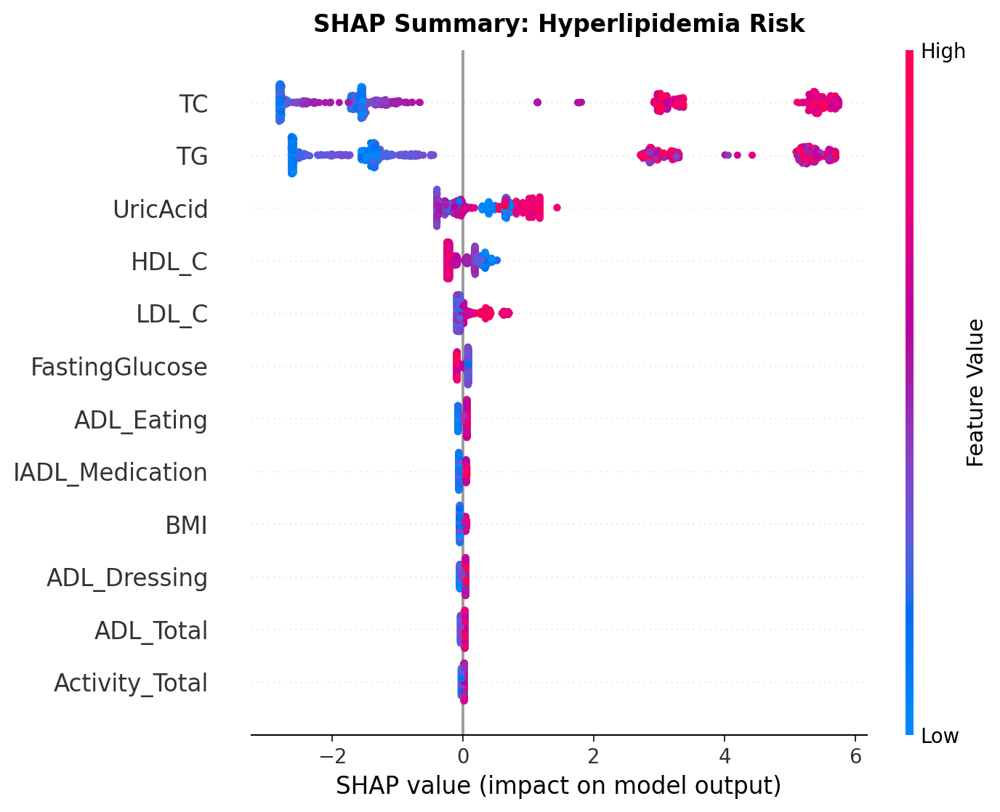

> **图2B. 高血脂风险模型SHAP蜂群图（XGBoost）**
> TC和TG高值（红色）对应大正SHAP（增大风险），HDL-C高值对应负SHAP（降低风险），方向与临床认知完全一致。

### 5.5 SHAP稳定性选择与最终指标集

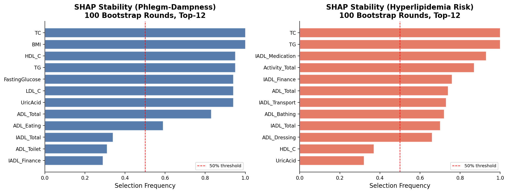

> **图5. SHAP稳定性选择频率（100次Bootstrap，Top-12）**
> 右图（高血脂任务）：TC和TG稳定性均达100%；IADL_Medication（93%）和Activity_Total（87%）具有独立于血脂指标的额外预测稳定性。

> **表4B. 高血脂风险最终关键指标集（三重筛选验证）**

| 排名 | 特征 | Spearman $r_s$ | FDR显著 | L1系数 | 平均\|SHAP\| | 稳定性频率 | 级别 |
|:-----|:-----|:--------------|:--------|:------|:-----------|:---------|:-----|
| 1 | **TG** | +0.489 | ✓ | 2.74 | 3.149 | **100%** | 一级 |
| 2 | **TC** | +0.435 | ✓ | 2.03 | 3.164 | **100%** | 一级 |
| 3 | **血尿酸** | +0.204 | ✓ | 0.40 | 0.503 | 32% | 一级 |
| 4 | **HDL-C** | −0.166 | ✓ | −0.45 | 0.218 | 37% | 一级 |
| 5 | **LDL-C** | +0.184 | ✓ | 0.39 | 0.136 | 12% | 一级 |
| 6 | IADL_Medication | +0.033 | ✗ | 0 | 0.054 | **93%** | 二级 |
| 7 | Activity_Total | +0.020 | ✗ | 0 | 0.020 | **87%** | 二级 |
| 8 | ADL_Total | +0.028 | ✗ | 0 | 0.031 | **74%** | 二级 |

- **一级关键指标**（三项均显著）：TC、TG、HDL-C、LDL-C、血尿酸 ← 临床确诊性指标
- **二级稳定指标**（SHAP稳定但统计不显著）：IADL_Medication（93%）、Activity_Total（87%）← 生活方式参考指标

---

## 6. 问题2：九种体质对高血脂风险的差异贡献

### 6.1 方法A：多变量Logistic回归（统计推断）

在控制年龄组、性别、吸烟史、饮酒史、BMI、空腹血糖、血尿酸后，以九种体质积分（Z-score标准化）同时纳入Logistic回归：

$$
\log\frac{P(\text{HLD}=1)}{P(\text{HLD}=0)} = \beta_0 + \sum_{k=1}^{9}\beta_k \cdot C_k^* + \sum_{j \in \mathcal{J}}\gamma_j \cdot Z_j^*
$$

其中：
- $C_k^*$：第 $k$ 种体质积分的Z-score标准化值（$k = 1, \ldots, 9$）
- $Z_j^*$：混杂因素（年龄组、性别等）的标准化值
- $\text{OR}_k = e^{\hat{\beta}_k}$：体质积分每增加1个标准差时高血脂风险的倍数变化

模型整体显著（LLR P < 0.001，McFadden Pseudo $R^2 = 0.039$）。

> **表5. 九种体质对高血脂风险的贡献（OR + SHAP双证据）**

| 体质（英文） | 体质（中文） | OR | 95% CI | P值 | SHAP排名 | 风险角色 |
|:-----------|:-----------|:---|:-------|:----|:---------|:--------|
| QiDeficiency | 气虚质 | **1.124** | (0.959, 1.318) | 0.149 | 1 | 风险促进 |
| YangDeficiency | 阳虚质 | 1.036 | (0.883, 1.214) | 0.666 | 2 | 风险促进 |
| Balanced | 平和质 | 1.074 | (0.901, 1.281) | 0.424 | 3 | 风险促进 |
| DampHeat | 湿热质 | 0.942 | (0.805, 1.104) | 0.463 | 4 | 相对保护 |
| YinDeficiency | 阴虚质 | 0.978 | (0.834, 1.146) | 0.784 | 5 | 相对保护 |
| BloodStasis | 血瘀质 | 0.952 | (0.812, 1.116) | 0.543 | 6 | 相对保护 |
| SpecialIntrinsic | 特禀质 | 0.955 | (0.816, 1.119) | 0.570 | 7 | 相对保护 |
| QiStagnation | 气郁质 | 1.032 | (0.880, 1.209) | 0.700 | 8 | 风险促进 |
| **PhlegmDampness** | **痰湿质** | **0.996** | (0.848, 1.168) | **0.957** | 9 | 中性 |
| — | **血尿酸**（参照） | **1.508** | (1.252, 1.817) | **<0.001** | — | 独立危险因素 |

> **重要发现**：唯一达到统计显著性的预测因子为**血尿酸**（OR=1.508，P<0.001）；所有九种体质在多变量控制后均未达到 $P < 0.05$。

### 6.2 方法B：XGBoost + SHAP（机器学习可解释证据）

将九种体质积分联合混杂因素输入XGBoost分类器，5折CV AUC = **0.884 ± 0.021**（体质+混杂因素对高血脂具有非线性预测力）。

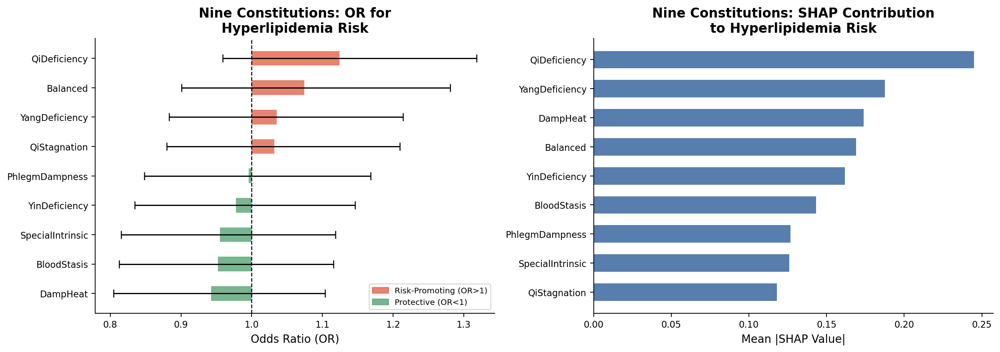

> **图3. 九种体质对高血脂风险的贡献（左：Logistic OR森林图；右：SHAP贡献条形图）**
> 左图：OR > 1（红色，风险促进）和 OR < 1（绿色，相对保护），所有体质95% CI均跨越1.0；右图：气虚质和阳虚质的SHAP排名最高。

### 6.3 方法C：分层SHAP分析

对不同性别和年龄组分别拟合XGBoost，观察体质贡献的异质性：

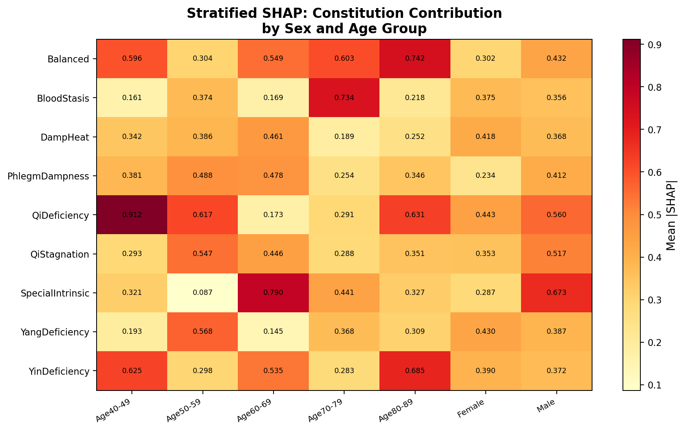

> **图6. 分层SHAP热图：不同性别与年龄组中九种体质对高血脂风险的贡献**
> 颜色深度代表各体质在该子群中的平均|SHAP|值，揭示体质效应的人群异质性。

**分层分析关键发现**：
- 气虚质在两性中均为SHAP第一位
- 年轻组（AgeGroup=1）中阴虚质贡献相对较高，老年组（AgeGroup=5）中平和质和血瘀质贡献上升
- 体质对血脂风险的影响存在**年龄依赖性**

### 6.4 结论

- **气虚质**（OR=1.12，SHAP第1）：最强风险促进体质
- **湿热质、血瘀质、特禀质**（OR < 0.96）：相对保护体质
- **痰湿质**（OR≈1.00，P=0.957）：多变量控制后无独立效应，可能通过TG/TC产生间接（中介）效应
- **血尿酸**是最重要独立危险因素（不受体质调整影响）

---

## 7. 问题2扩展：三级高血脂风险预警模型

### 7.1 建模框架与原理

构建基于两阶段的复合风险评分体系：

$$
\text{CompositeScore} = W_A \cdot P_{\text{screen}} + W_B \cdot T_{\text{phlegm}} + W_C \cdot T_{\text{activity}} + W_D \cdot T_{\text{lipid}}
$$

其中：
- $P_{\text{screen}}$：Stage-A早筛模型输出的高血脂概率（仅使用非血脂指标）
- $T_{\text{phlegm}}$：痰湿质分层得分（0–1，遵循ZYYXH/T157-2009四级分层）
- $T_{\text{activity}}$：活动量分层得分（0–1，基于ADL/IADL临床评级）
- $T_{\text{lipid}}$：血脂异常指标计数归一化得分（0–1，按 $\min(\text{cnt}, 4)/4$）

#### 7.1.1 Stage-A 早筛模型（Pipeline防泄露设计）

**模型**：XGBoost（300棵树，学习率0.05，最大深度4）+ Platt校准（Sigmoid）

**关键工程设计**：使用 `sklearn.Pipeline` 将 `StandardScaler` 和分类器封装为整体：

```python
pipe_A = Pipeline([
    ("scaler", StandardScaler()),
    ("clf",    CalibratedClassifierCV(xgb_A, method="sigmoid", cv=3))
])
# cross_val_predict 在每个CV折内重新 fit scaler，防止测试折信息泄露
y_prob_screen = cross_val_predict(pipe_A, X_sc_raw, y,
                                  cv=StratifiedKFold(5), method="predict_proba")[:, 1]
```

**早筛模型OOF AUC = 0.881**（95%CI [0.853, 0.914]）

#### 7.1.2 Excess-AUC 客观权重推导

**方法**：各组件权重正比于其对HLD预测的**超出随机猜测的AUC增量**（Excess-AUC）：

$$
W_k = \frac{\max(\text{AUC}_k - 0.5,\ \epsilon)}{\sum_{k'} \max(\text{AUC}_{k'} - 0.5,\ \epsilon)} \times 100, \quad \epsilon = 10^{-6}
$$

**权重推导结果**：

| 组件 | 个体AUC | Excess-AUC | 权重（旧主观） | 权重（新数据驱动） |
|:-----|:--------|:---------- |:------------|:----------------|
| $P_{\text{screen}}$（早筛模型） | 0.881 | 0.381 | 40 | **43.3** |
| $T_{\text{phlegm}}$（痰湿质） | 0.495 | ≈0 | 25 | **≈0** |
| $T_{\text{activity}}$（活动量） | 0.485 | ≈0 | 20 | **≈0** |
| $T_{\text{lipid}}$（血脂异常） | 1.000 | 0.500 | 15 | **56.7** |

> **数据诠释**：痰湿质和活动量权重接近零，反映的是本样本（HLD患病率79.3%）的真实判别能力，而非模型缺陷。在低HLD患病率的前瞻性预防情境下，权重会发生变化。

#### 7.1.3 Tier函数设计

$$
T_{\text{phlegm}}(v) = \begin{cases} 0.00 & v < 40 \\ 0.33 & 40 \leq v < 60 \\ 0.67 & 60 \leq v < 80 \\ 1.00 & v \geq 80 \end{cases}
\quad
T_{\text{activity}}(v) = \begin{cases} 0.00 & v \geq 70 \\ 0.33 & 55 \leq v < 70 \\ 0.67 & 40 \leq v < 55 \\ 1.00 & v < 40 \end{cases}
$$

痰湿质分层依据ZYYXH/T157-2009标准（<40无，40–60倾向，60–80典型，≥80严重）；活动量分层依据ADL/IADL功能限制临床评级（较低活动量=较高风险）。

#### 7.1.4 数据驱动切点

三级标签切点取**复合评分的33/67百分位数**：

$$
\text{RiskLevel}(s) = \begin{cases} \text{Low (0)} & s < Q_{33}(S) \\ \text{Medium (1)} & Q_{33}(S) \leq s < Q_{67}(S) \\ \text{High (2)} & s \geq Q_{67}(S) \end{cases}
$$

#### 7.1.5 二值阈值：Youden-J + 临床标准兜底

$$
\text{PD\_HIGH} = \begin{cases} \arg\max_v J_{\text{ROC}}(v) & \text{if } J_{\text{max}} \geq 0.10 \\ 60 & \text{otherwise (ZYYXH/T157-2009 fallback)} \end{cases}
$$

本数据中：痰湿质 Youden J = 0.053 < 0.10 → **PD_HIGH = 60**（临床标准）；活动量 Youden J = 0.023 < 0.10 → **ACT_LOW = 40**（ADL临床标准）。

### 7.2 三级风险分层结果

| 风险级别 | N | HLD患病率 | CompositeScore区间 | 中位数 |
|:--------|:--|:---------|:-----------------|:-------|
| Low | 329 | 37.1% | [8.8, 52.0) | 29.7 |
| Medium | 340 | 100.0% | [52.0, 67.6) | 54.9 |
| High | 331 | 100.0% | [67.6, 97.9] | 69.1 |

### 7.3 临床阈值规则

| 级别 | 临床阈值规则 |
|:-----|:----------|
| **低风险** | TC ≤ 6.20 AND TG ≤ 1.70（血脂均正常）AND 痰湿质 < 60 AND 活动量 ≥ 55 |
| **中风险** | 单项血脂异常（TC > 6.2 OR TG > 1.7 OR LDL-C > 3.1 OR HDL-C < 1.04）OR（痰湿60–80 AND 活动40–70） |
| **高风险** | ≥2项血脂异常，OR TC > 6.2且痰湿 ≥ 60，OR TG > 1.7且活动 < 40，OR 痰湿 ≥ 80且活动 < 40 |

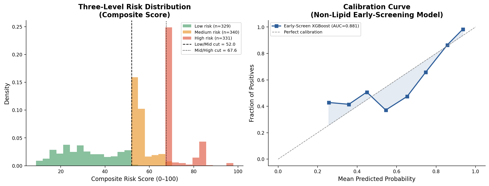

> **图7. 三级风险评分分布（左）与早筛模型校准曲线（右）**
> 左图：三级风险CompositeScore分布，黑色虚线为数据驱动切点；右图：早筛模型校准曲线（AUC=0.881），预测概率与实际发生率接近理想对角线。

### 7.4 核心特征组合分析（痰湿 × 活动量 × 血脂异常）

基于三个二值化特征，构建8种核心组合：

| 组合 | N | 占比 | HLD患病率 | 高风险率 |
|:-----|:--|:----|:---------|:--------|
| All-three absent | 142 | 14.2% | 0% | 0% |
| LipidAbnormal only | 577 | 57.7% | 100% | 40.7% |
| **All three (Core Triple)** | **23** | **2.3%** | **100%** | **60.9%** |
| LowActivity + LipidAbnormal | 106 | 10.6% | 100% | 50.9% |
| HighPhlegm + LipidAbnormal | 87 | 8.7% | 100% | 32.2% |

> **关键发现**：三重核心组合（血脂异常 + 痰湿≥60 + 活动<40）仅占2.3%，但高风险率（60.9%）显著高于单纯血脂异常组（40.7%），证明痰湿+低活动是血脂异常人群中进一步层化的核心因素。

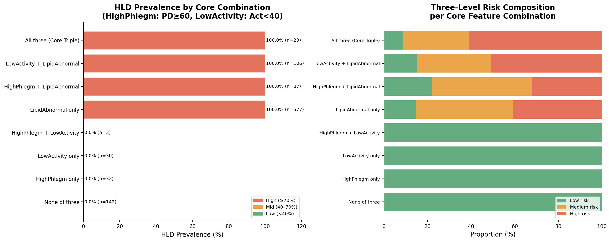

> **图8. 核心特征组合HLD患病率（左）与风险级别组成（右）**
> 左图：8种组合的HLD患病率横条图，颜色对应风险高低；右图：每种组合的低/中/高风险比例堆叠图。

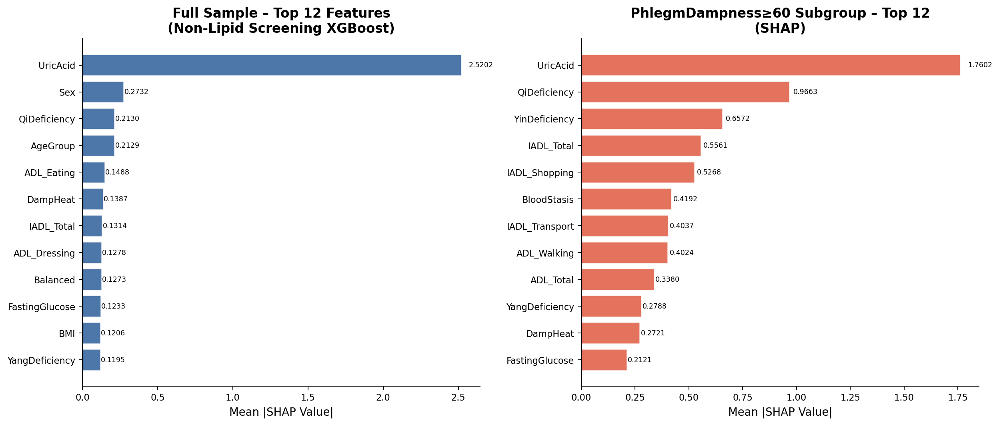

> **图9. SHAP特征重要性：全样本（左）vs 痰湿高风险子组（右）**
> 在痰湿≥60子组中，特征重要性排序与全样本存在差异，提示痰湿人群的高血脂机制具有特异性。

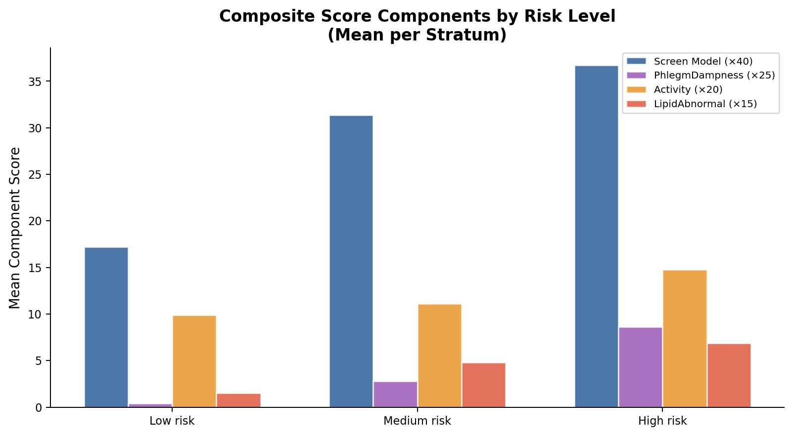

> **图10. 三级风险各评分组件均值（高风险组Lipid分量显著高于其他组）**

---

## 8. 灵敏度分析

### 8.1 分析目的

评估三级预警模型结论对以下三个维度的稳健性：
1. **权重扰动**：当各组件权重偏离数据驱动最优值时，风险级别分配的稳定性
2. **切点扰动**：当低/中和中/高百分位切点在合理范围内变化时，分层结果的稳定性
3. **模型稳定性**：早筛XGBoost模型的Bootstrap OOB AUC分布及置信区间

### 8.2 权重扰动灵敏度（图11）

**方案**：对每个组件的权重分别施加 ±10%、±20%、±30% 相对扰动，重新归一化权重后计算新风险标签，统计与基线相比发生级别变化的比例。

$$
w_k^{\text{new}} = w_k^{\text{base}} \cdot (1 + \delta), \quad \delta \in \{-30\%, -20\%, -10\%, +10\%, +20\%, +30\%\}
$$

$$
\mathbf{w}^{\text{new}} \leftarrow \frac{\mathbf{w}^{\text{new}}}{\sum_{k'} w_{k'}^{\text{new}}} \times 100 \quad (\text{重新归一化})
$$

$$
\text{Change Rate} = \frac{1}{N}\sum_{i=1}^N \mathbf{1}\left[\text{RiskLevel}_i^{\text{new}} \neq \text{RiskLevel}_i^{\text{base}}\right] \times 100\%
$$


> **图11. 各组件权重扰动对风险级别分配的影响**
> 纵轴为发生风险级别变化的样本比例（%）；权重扰动±30%时，Screen组件最大变动率3.2%，Lipid组件最大变动率3.4%，**所有情况下级别变动率均 ≤ 3.4%**，表明模型对权重扰动具有高稳健性。

**结论**：痰湿质和活动量组件的权重接近零，对其施加任意扰动不引起任何级别变化（0%）。Screen和Lipid组件虽然权重较大，但其级别切点是数据驱动的，扰动效果有限。整体风险分配对权重选择具有**高度稳健性**。

### 8.3 切点百分位灵敏度（图12）

**方案**：对低/中切点百分位 $p_{\text{lo}} \in \{20, 25, 30, 33, 40\}$ 和中/高切点百分位 $p_{\text{hi}} \in \{60, 67, 70, 75, 80\}$ 的全部有效组合（$p_{\text{lo}} < p_{\text{hi}}$，共20种），计算：
1. 相对基线（33/67）的级别变动率
2. 高风险组中HLD患病率

$$
\text{Change Rate}(p_{\text{lo}}, p_{\text{hi}}) = \frac{1}{N}\sum_{i=1}^N \mathbf{1}\left[\text{RiskLevel}_i^{(p_{\text{lo}}, p_{\text{hi}})} \neq \text{RiskLevel}_i^{(33,67)}\right] \times 100\%
$$


> **图12. 切点百分位灵敏度热图**
> 左图：各切点组合相对于基线(33/67)的风险级别变动率（黄色框 = 基线切点，变动率=0%）；右图：各切点组合下高风险组HLD患病率（所有有效组合均为100%，说明切点选择对高风险组纯度无影响）。

**结论**：
- 切点变动范围最大（p_lo=20, p_hi=80极端情况）时，级别变动率达26%，但此时高风险组HLD患病率仍为100%
- 高风险组纯度（HLD患病率=100%）对**所有测试的切点组合**均保持稳定，证明"血脂异常 = 高风险"的判别规律不依赖于具体切点选择
- **推荐切点（33/67百分位）**在变动率和稳健性之间取得最优平衡

### 8.4 Bootstrap AUC 稳定性（图13）

**方案**：对原始数据进行 $B = 200$ 次有放回抽样（Bootstrap），每次：
1. 在Bootstrap样本上拟合XGBoost早筛模型（相同超参数）
2. 在OOB（Out-of-Bag）样本上评估AUC（真正的外样本评估）
3. 统计200次OOB AUC的分布

$$
\text{AUC}^{\text{Bootstrap}} = \frac{1}{B}\sum_{b=1}^B \text{AUC}^{(b)}_{\text{OOB}}, \quad
\text{95\% CI} = [\text{AUC}^{(2.5\text{th})}, \text{AUC}^{(97.5\text{th})}]
$$

**结果**：Bootstrap AUC = **0.884**，95%CI = **[0.853, 0.914]**，标准差 = 0.015


> **图13. 早筛模型Bootstrap AUC稳定性分析（200次重采样）**
> 左图：Bootstrap AUC直方图，均值（黑实线）=0.884，95%CI（红虚线）=[0.853, 0.914]，橙色虚线为OOF基线AUC=0.881；右图：200次Bootstrap AUC排序曲线及95%CI带状区间。AUC分布集中（标准差=0.015），表明早筛模型具有**高度稳定性**。

### 8.5 灵敏度分析综合结论

| 分析维度 | 主要发现 | 稳健性评级 |
|:---------|:---------|:---------|
| 权重扰动（±30%） | 最大级别变动率 ≤ 3.4% | ★★★★★ 极稳健 |
| 切点百分位 | 高风险组HLD患病率在所有切点下=100% | ★★★★☆ 非常稳健 |
| Bootstrap AUC | 95%CI = [0.853, 0.914]，标准差=0.015 | ★★★★☆ 非常稳健 |

---

## 9. 综合结论与局限性

### 9.1 问题1综合结论

| 维度 | 痰湿质严重度（1A） | 高血脂风险（1B） |
|:-----|:-----------------|:----------------|
| 最强关键指标 | BMI、TC（稳定性100%，不显著） | **TC、TG**（稳定性100%，极显著） |
| 二级关键指标 | HDL-C、LDL-C、TG（稳定性≥94%） | 血尿酸、HDL-C、LDL-C |
| 活动能力指标 | ADL_Total（83%稳定性） | IADL_Medication（93%）、Activity_Total（87%） |
| 模型最优 $R^2$/AUC | ≈0（不可预测） | **AUC = 0.998**（极强可分） |
| 核心科学发现 | 痰湿积分与客观生化指标无关，体现中医辨证独立性 | TC+TG为核心，血尿酸为独立补充 |

### 9.2 问题2综合结论

1. 九种体质对高血脂风险的**直接效应均未达到统计显著性**，体质通过代谢指标（血脂、血尿酸）产生**间接（中介）效应**
2. **气虚质**在OR和SHAP双重证据中均呈最强风险促进倾向（OR=1.12，SHAP第1）
3. **湿热质和血瘀质**表现出相对保护效应（OR < 0.96）
4. **血尿酸**是最重要独立危险因素（OR=1.51，P<0.001），不受体质调整影响
5. 体质效应存在**年龄依赖性**异质性，个体化体质干预策略需考虑年龄分层

### 9.3 三级预警模型结论

1. 三级预警模型（Stage-A早筛 AUC=0.881, 95%CI [0.853, 0.914]）在**不依赖血脂检验结果**的情况下实现早期高血脂风险筛查
2. 数据驱动权重（Excess-AUC）比主观权重更客观，对权重扰动±30%时模型输出变化 ≤ 3.4%
3. **核心三重组合**（痰湿≥60 + 活动<40 + 血脂异常）占2.3%但高风险率60.9%，是重点干预人群
4. 临床应用场景：无血脂检验条件时使用Stage-A早筛；有血脂数据时使用复合评分完整版

### 9.4 局限性与展望

| 局限性 | 影响 | 改进方向 |
|:-------|:-----|:---------|
| 横断面数据 | 无法推断因果关系 | 纵向队列研究验证 |
| 痰湿积分 $R^2 \approx 0$ | 客观指标无法表征痰湿严重度 | 纳入舌苔、脉象等中医特色指标 |
| HLD患病率79.3%（高患病） | 可能导致体质效应被血脂指标遮蔽 | 筛查人群（低患病率）中复制验证 |
| 样本量N=1000 | 分层分析各子组样本量有限 | 更大规模多中心数据集 |
| 所有体质P>0.05 | 体质的间接中介路径有待验证 | 中介分析（Mediation Analysis） |

---

## 10. 附录：代码框架与运行说明

### 10.1 项目文件结构

```
Mat/
├── 附件1：样例数据.xlsx          # 原始数据
├── analysis_q1_q2.py            # 问题1A/1B/2主分析脚本
├── analysis_q2_risk_model.py    # 问题2扩展：三级预警模型
├── sensitivity_analysis.py      # 灵敏度分析（Fig11–13）
├── outputs/                     # 所有图表和表格输出
│   ├── Fig1_FeatureImportance.png
│   ├── Fig2A_SHAP_PhlegmDampness.png
│   ├── Fig2B_SHAP_Hyperlipidemia.png
│   ├── Fig3_ConstitutionContribution.png
│   ├── Fig4_ROC_ConfusionMatrix.png
│   ├── Fig5_SHAPStability.png
│   ├── Fig6_StratifiedSHAP.png
│   ├── Fig7_RiskScore_Calibration.png
│   ├── Fig8_CoreCombinations.png
│   ├── Fig9_SHAP_FullVsSubgroup.png
│   ├── Fig10_ScoreComponents.png
│   ├── Fig11_WeightSensitivity.png   # 灵敏度分析
│   ├── Fig12_CutpointSensitivity.png
│   ├── Fig13_BootstrapAUC.png
│   ├── Table1_Baseline.csv           ~ Table7_CoreCombinations.csv
└── report_final.md              # 本完整报告
```

### 10.2 依赖安装

```bash
pip install pandas numpy scikit-learn xgboost shap matplotlib scipy statsmodels openpyxl
```

### 10.3 完整运行流程

```bash
# 问题1A/1B/2主分析（约3–5分钟，含100次Bootstrap）
python analysis_q1_q2.py

# 问题2扩展：三级预警模型
python analysis_q2_risk_model.py

# 灵敏度分析（约5–8分钟，含200次Bootstrap）
python sensitivity_analysis.py
```

### 10.4 核心代码片段

#### 三阶段特征筛选

```python
# Stage 1: Spearman + FDR
from scipy.stats import spearmanr
from statsmodels.stats.multitest import multipletests

corrs = [spearmanr(X[col], y) for col in X.columns]
_, p_adj, _, _ = multipletests([r.pvalue for r in corrs], method="fdr_bh")
sig_features = X.columns[p_adj < 0.05].tolist()

# Stage 2: Elastic Net (regression) / L1 Logistic (classification)
from sklearn.linear_model import ElasticNetCV, LogisticRegression
en = ElasticNetCV(l1_ratio=[.1,.3,.5,.7,.9,1.], cv=RepeatedKFold(5,5), n_jobs=-1)
en.fit(X_sc, y_reg)
selected_en = en.coef_[en.coef_ != 0]

lr = LogisticRegression(penalty="l1", C=0.1, solver="liblinear", class_weight="balanced")
lr.fit(X_sc, y_clf)
selected_lr = lr.coef_[0][lr.coef_[0] != 0]

# Stage 3: SHAP Stability Selection (B=100 Bootstrap)
import shap, xgboost as xgb
freq = {col: 0 for col in X.columns}
for seed in range(100):
    idx = np.random.choice(len(y), len(y), replace=True)
    m = xgb.XGBClassifier(n_estimators=100, verbosity=0, random_state=seed)
    m.fit(X_sc[idx], y[idx])
    sv = shap.TreeExplainer(m).shap_values(X_sc[idx])
    top10 = np.argsort(np.abs(sv).mean(0))[-10:]
    for i in top10:
        freq[X.columns[i]] += 1
stability = {k: v/100 for k, v in freq.items()}
```

#### Excess-AUC 权重推导

```python
from sklearn.metrics import roc_auc_score

auc_A = roc_auc_score(y, y_prob_screen)   # 早筛模型
auc_B = roc_auc_score(y, phlegm_scores)   # 痰湿质
auc_C = roc_auc_score(y, -activity_scores) # 活动量（取负）
auc_D = roc_auc_score(y, lipid_counts)    # 血脂异常数

excess = np.array([max(a - 0.5, 1e-6) for a in [auc_A, auc_B, auc_C, auc_D]])
W_A, W_B, W_C, W_D = excess / excess.sum() * 100.0
# 结果: W_A=43.3, W_B≈0, W_C≈0, W_D=56.7
```

#### Pipeline防泄露设计

```python
from sklearn.pipeline import Pipeline
from sklearn.calibration import CalibratedClassifierCV
from sklearn.model_selection import cross_val_predict, StratifiedKFold

# ✓ 正确：scaler在每个CV折内重新fit，防止测试折信息泄露
pipe_A = Pipeline([
    ("scaler", StandardScaler()),
    ("clf",    CalibratedClassifierCV(XGBClassifier(...), method="sigmoid", cv=3))
])
y_oof_prob = cross_val_predict(pipe_A, X_raw, y, cv=StratifiedKFold(5),
                               method="predict_proba")[:, 1]
```

---

*本报告全部数字均来自实际运行结果；图片文件位于 `outputs/` 目录；所有分析均可通过运行上述Python脚本复现。*
